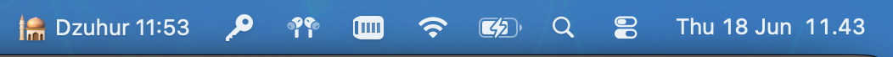

# SholatBar Mac

SholatBar is a lightweight macOS menu bar app for keeping the next prayer time visible without opening a calendar, widget, or full-screen app.

It sits quietly in the menu bar, shows the upcoming sholat time, and opens a compact schedule popover when clicked.

## Highlights

- Menu bar display for the next prayer: `Subuh`, `Dzuhur`, `Ashar`, `Maghrib`, or `Isya`
- Compact daily schedule in a native macOS popover
- Location-based prayer time calculation with a Jakarta fallback
- Indonesian prayer method based on Kemenag-style angles
- Indonesian date formatting
- Launch at Login toggle
- Menu bar only: no Dock icon, no main window
- Native SwiftUI and AppKit implementation

## Preview

The menu bar title updates automatically and stays visible while you work:



Clicking the menu bar item opens a small popover with today's full schedule and highlights the next prayer.

## Download

Grab the ready-to-use app from:

[Download SholatBar for macOS](dist/SholatBar-mac.zip)

Unzip it, move `SholatBar.app` to your `Applications` folder, then open it from there.

To package the app as a macOS DMG, run:

```bash
./scripts/create-dmg.sh
```

The DMG will be created at `dist/SholatBar-mac.dmg`.

## Requirements

- macOS
- Xcode
- Location permission enabled for the most accurate local prayer times

## Getting Started

1. Clone the repository:

   ```bash
   git clone git@github.com:geekfast/sholatbar-mac.git
   cd sholatbar-mac
   ```

2. Open the project:

   ```bash
   open SholatBar.xcodeproj
   ```

3. Build and run from Xcode.

When the app starts, macOS may ask for location permission. If permission is not granted or the location is not available yet, SholatBar uses Jakarta as the default location.

## How It Works

SholatBar calculates prayer times locally using solar position math. It uses the current date, time zone, latitude, and longitude to estimate:

- Subuh
- Dzuhur
- Ashar
- Maghrib
- Isya

The menu bar label refreshes with the next prayer, while the popover shows the full daily list.

## Project Structure

```text
SholatBar/
  SholatBarApp.swift      Main app, status bar controller, prayer logic, UI
  ContentView.swift       Default SwiftUI starter view
  Assets.xcassets/        App icon and accent color

SholatBar.xcodeproj/      Xcode project
```

## Notes

This app is intentionally small and focused: one job, always visible, minimal interruption.

Future improvements could include city selection, calculation method settings, notifications before adzan, and a cleaner preferences screen.

## License

No license has been added yet.
